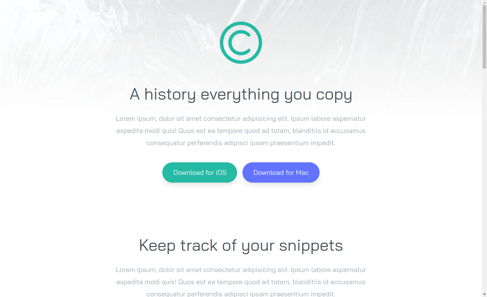
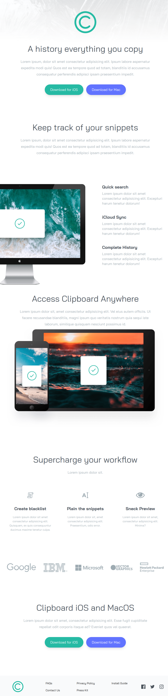
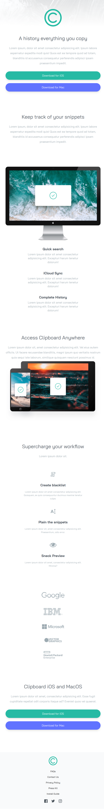
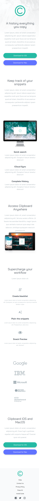

# Frontend Mentor - Clipboard landing page solution

This is a solution to the [Clipboard landing page challenge on Frontend Mentor](https://www.frontendmentor.io/challenges/clipboard-landing-page-5cc9bccd6c4c91111378ecb9). Frontend Mentor challenges help you improve your coding skills by building realistic projects.

## Table of contents

- [Overview](#overview)
  - [The challenge](#the-challenge)
  - [Screenshot](#screenshot)
  - [Links](#links)
- [My process](#my-process)
  - [Built with](#built-with)
  - [What I learned](#what-i-learned)
  - [Useful resources](#useful-resources)
- [Author](#author)

## Overview

### The challenge

Users should be able to:

- View the optimal layout for the site depending on their device's screen size
- See hover states for all interactive elements on the page

### Screenshot



<details>
  <summary>Full screenshot (1920px)</summary>
  
  
</details>

<details>
  <summary>Full screenshot XL (1440px)</summary>
  
  
</details>

<details>
  <summary>Full screenshot LG (976px)</summary>
  
  
</details>

<details>
  <summary>Full screenshot MD (768px)</summary>
  
  
</details>

<details>
  <summary>Full screenshot SM (480px)</summary>
  
  
</details>

### Links

- Solution URL: [Github repo](https://github.com/evk11/simple-landing-tailwind)
- Live Site URL: [Netlify](https://animated-dragon-72d0ec.netlify.app/)

## My process

### Built with

- Semantic HTML5 markup
- TailwindCSS
- Flexbox
- Mobile-first workflow
- Webpack & Postcss

### What I learned

CSS filter function is used to change svg color on hover. Read more on alternative approaches [below](#useful-resources).

```css
/* main.css */
.icon:hover {
  filter: invert(53%) sepia(68%) saturate(434%) hue-rotate(121deg) brightness(
      101%
    ) contrast(94%);
}
```

Extends Tailwind color palette with custom HSL colors.

```js
// tailwind.config.js
extend: {
    colors: {
        "strong-cyan": 'hsl(171, 66%, 44%)',
        "light-blue": 'hsl(233, 100%, 69%)',
        "grayish-blue": 'hsl(201, 11%, 66%)',
        "dark-grayish-blue": 'hsl(210, 10%, 33%)',
    },
    ...
```

to be used as inline utility class

```html
<p class="mx-auto max-w-md text-center text-grayish-blue"></p>

<li><a href="#" class="hover:text-strong-cyan">FAQs</a></li>
```

### Useful resources

- [PerfectPixel Crome Extension](https://www.welldonecode.com/perfectpixel/) - Creates overlay to match you page w/ design mockup. Useful for optimizing pages for different PPI/Retina screens.
- [Change Color of SVG on Hover](https://css-tricks.com/change-color-of-svg-on-hover/) - There are a lot of different ways to use SVG. Depending on which way, the tactic for recoloring that SVG in different states or conditions — :hover, :active, :focus, class name change, etc. — This guide will help you choose the approach that fits you.

## Author

- Frontend Mentor - [@evk11](https://www.frontendmentor.io/profile/evk11)
- LinkedIn - [@eugenekulikou](https://www.linkedin.com/in/eugenekulikou/)
